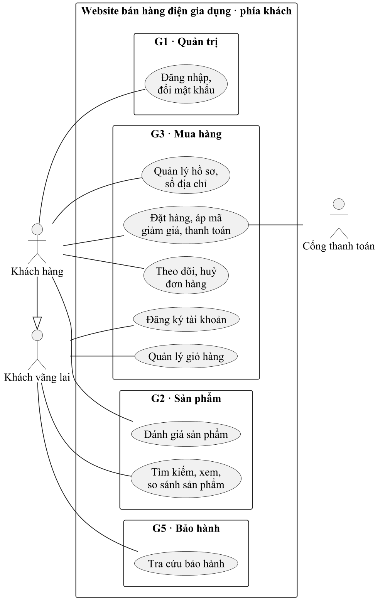
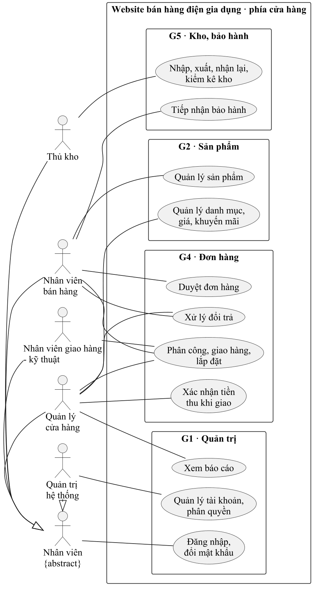

# Danh mục use case hệ thống

Bản nháp 0.2 (đã soát chéo) · G1 giữ · việc t101, t104 · tên và mã ở đây là **chuẩn chung**, sơ đồ use case phân hệ của từng gói phải dùng đúng

## 1. Use case tổng quát

Tách làm hai sơ đồ (phía khách, phía cửa hàng) vì gộp chung thì quá nhiều đường nối cắt nhau, in ra không đọc được.
Mỗi hình elip trên sơ đồ tổng quát là **một nhóm** use case của mục 2, không phải một use case.

Mỗi gói vẽ sơ đồ phân rã của phân hệ mình (việc t102) với các use case ở mục 2.

## 2. Use case theo phân hệ (35 use case)

Cột **Tác nhân** là đề xuất ban đầu; gói nào thấy sau khảo sát cần đổi thì đổi trong phần của mình và báo G1 cập nhật bảng này.
Cột **Đặc tả**: ✓ là use case nên đặc tả (việc t103); ★ là use case vừa đặc tả vừa thiết kế sơ đồ tuần tự (việc t142, t143).

### G1 · Quản trị hệ thống và báo cáo
| Mã | Use case | Tác nhân | Đặc tả |
|---|---|---|---|
| UC-HT-01 | Đăng nhập | Nhân viên, Khách hàng | ★ (ví dụ có sẵn trong `mau-dac-ta.md`) |
| UC-HT-02 | Quản lý tài khoản nhân viên | Quản trị hệ thống | ✓ |
| UC-HT-03 | Phân quyền theo vai trò | Quản trị hệ thống | |
| UC-HT-04 | Xem báo cáo doanh thu | Quản lý cửa hàng | ★ |
| UC-HT-05 | Xem báo cáo tồn kho và bảo hành | Quản lý cửa hàng | |
| UC-HT-06 | Đổi mật khẩu | Nhân viên, Khách hàng | |

### G2 · Sản phẩm và khuyến mãi
| Mã | Use case | Tác nhân | Đặc tả |
|---|---|---|---|
| UC-SP-01 | Quản lý danh mục, thương hiệu | Quản lý cửa hàng | |
| UC-SP-02 | Quản lý sản phẩm và thông số kỹ thuật | Nhân viên bán hàng | ★ |
| UC-SP-03 | Cập nhật giá bán | Quản lý cửa hàng | |
| UC-SP-04 | Quản lý khuyến mãi, mã giảm giá | Quản lý cửa hàng | ✓ |
| UC-SP-05 | Tìm kiếm, lọc sản phẩm | Khách vãng lai | ★ |
| UC-SP-06 | Xem chi tiết, so sánh sản phẩm | Khách vãng lai | |
| UC-SP-07 | Đánh giá sản phẩm | Khách hàng | |

### G3 · Mua hàng trực tuyến và thanh toán
| Mã | Use case | Tác nhân | Đặc tả |
|---|---|---|---|
| UC-MH-01 | Đăng ký tài khoản khách hàng | Khách vãng lai | |
| UC-MH-02 | Quản lý hồ sơ, sổ địa chỉ | Khách hàng | |
| UC-MH-03 | Quản lý giỏ hàng | Khách vãng lai | |
| UC-MH-04 | Đặt hàng | Khách hàng (hoặc Khách vãng lai, chờ khảo sát) | ★ |
| UC-MH-05 | Thanh toán trực tuyến | Khách hàng, Cổng thanh toán | ★ |
| UC-MH-06 | Theo dõi đơn hàng | Khách hàng | ✓ |
| UC-MH-07 | Huỷ đơn hàng | Khách hàng | |
| UC-MH-08 | Áp mã giảm giá (`extend` UC-MH-04) | Khách hàng | |

### G4 · Xử lý đơn, giao hàng, lắp đặt, đổi trả
| Mã | Use case | Tác nhân | Đặc tả |
|---|---|---|---|
| UC-DH-01 | Duyệt, xác nhận đơn hàng | Nhân viên bán hàng | ★ |
| UC-DH-02 | Phân công giao hàng, lắp đặt | Quản lý cửa hàng | ✓ |
| UC-DH-03 | Cập nhật trạng thái giao hàng | Nhân viên giao hàng – kỹ thuật; Nhân viên bán hàng (đơn gửi đơn vị vận chuyển) | |
| UC-DH-04 | Xác nhận tiền thu khi giao | Quản lý cửa hàng | |
| UC-DH-05 | Lập biên bản lắp đặt | Nhân viên giao hàng – kỹ thuật | |
| UC-DH-06 | Xử lý đổi trả, hoàn tiền | Nhân viên bán hàng (tiếp nhận), Quản lý cửa hàng (duyệt) | ★ |

### G5 · Kho, nhà cung cấp, bảo hành
| Mã | Use case | Tác nhân | Đặc tả |
|---|---|---|---|
| UC-KB-01 | Quản lý nhà cung cấp | Thủ kho | |
| UC-KB-02 | Lập đơn đặt hàng nhà cung cấp | Thủ kho | |
| UC-KB-03 | Lập phiếu nhập kho, ghi số serial | Thủ kho | ★ |
| UC-KB-04 | Lập phiếu xuất kho theo đơn | Thủ kho | ✓ |
| UC-KB-05 | Kiểm kê, cảnh báo tồn thấp | Thủ kho | |
| UC-KB-06 | Tiếp nhận bảo hành (`include` UC-KB-07) | Nhân viên bán hàng | ★ |
| UC-KB-07 | Tra cứu bảo hành (theo số serial hoặc số điện thoại) | Khách vãng lai | |
| UC-KB-08 | Nhận lại máy về kho (giao không thành công, đổi trả) | Thủ kho | |

## 3. Chỗ các phân hệ nối vào nhau

Đây là chỗ dễ vỡ nhất khi ghép báo cáo. Hai gói ở hai đầu mỗi dòng phải đọc đặc tả của nhau trước khi chốt.

| Use case trước | Use case sau | Nối bằng | Hai gói phải thống nhất |
|---|---|---|---|
| UC-SP-04 Khuyến mãi (G2) | UC-MH-08 Áp mã giảm giá (G3) | Mã giảm giá còn hạn | Một đơn được áp mấy khuyến mãi (đề xuất: một) |
| UC-MH-04 Đặt hàng (G3) | UC-DH-01 Duyệt đơn (G4) | Đơn **Chờ xác nhận** | Thông tin trên đơn đủ để gọi xác nhận |
| UC-DH-01 Duyệt đơn (G4) | UC-KB-04 Lập phiếu xuất (G5) | Đơn **Đã xác nhận** | Thủ kho chọn serial cụ thể khi xuất |
| UC-KB-04 Lập phiếu xuất (G5) | UC-DH-03 Cập nhật giao hàng (G4) | Đơn **Đang giao** (Thủ kho chuyển khi lập phiếu xuất, đã chốt) | |
| UC-DH-03 Giao không thành công (G4) | UC-KB-08 Nhận lại máy (G5) | Máy **Đã xuất** quay về | Ai mang máy về, kiểm gì |
| UC-DH-06 Đổi trả được duyệt (G4) | UC-KB-08 Nhận lại máy (G5) | Máy **Trả về kho** | Máy trả về bán lại hay gửi hãng |
| UC-DH-03, UC-DH-05 Hoàn thành (G4) | UC-SP-07 Đánh giá (G2) | Đơn **Hoàn thành** | Chỉ người đã mua mới được đánh giá |
| Đơn, phiếu nhập, bảo hành (G3, G4, G5) | UC-HT-04, UC-HT-05 Báo cáo (G1) | Đọc dữ liệu | Tên thuộc tính ngày, tiền, trạng thái |

Trạng thái đơn và trạng thái chiếc máy dùng chung xem `lop-va-trang-thai-chung.md`.
