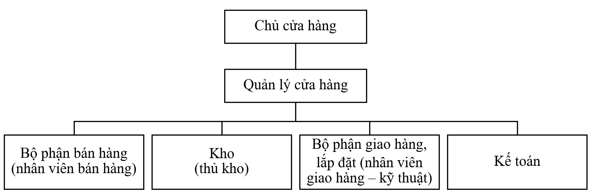

# Đánh giá hiện trạng tổ chức và thuật ngữ nghiệp vụ

Bản nháp 0.1 (07/10/2026) · G1 giữ · việc t85 · làm theo **bước 1 và bước 2** của mô hình hoá nghiệp vụ (C3-7 đến C3-17)

> **Mọi nội dung dưới đây là giả định trước khảo sát**, viết sẵn để cả nhóm thấy khuôn trình bày.
> Sau buổi phỏng vấn tuần 9, G1 viết lại toàn bộ theo lời cửa hàng thật (tiêu chí "thực tế và khả thi" chiếm 20% điểm bài nhóm).
> Chỗ nào chưa biết thì để `……`, không bịa số liệu.

Mục đích của bước đánh giá hiện trạng (C3-8): nắm thông tin tổ chức, xác định các đối tượng liên quan và khách hàng,
định nghĩa phạm vi mô hình hoá, tìm chỗ cần cải tiến và mục tiêu chính của tổ chức.

## 1. Cơ cấu tổ chức (C3-9, C3-10)

Mô tả từng bộ phận giống ví dụ siêu thị ở slide 10 (mỗi bộ phận: gồm ai, làm gì, báo cáo cho ai, bao lâu một lần):

- **Chủ cửa hàng:** ……. Theo dõi doanh thu, quyết định nhập hàng và khuyến mãi; nhận báo cáo kinh doanh hằng tháng hoặc đột xuất.
- **Quản lý cửa hàng:** …… người. Điều phối hoạt động hằng ngày, duyệt giá, đơn đặt hàng nhà cung cấp, đổi trả; xếp lịch giao lắp.
- **Bộ phận bán hàng:** …… nhân viên. Tư vấn tại cửa hàng và qua điện thoại, chốt đơn, lập hoá đơn, tiếp nhận đổi trả và bảo hành.
- **Kho:** …… thủ kho. Nhận hàng từ nhà cung cấp, ghi số serial, xuất kho theo đơn, kiểm kê cuối tháng.
- **Bộ phận giao hàng, lắp đặt:** …… nhân viên. Giao hàng, lắp đặt, thu tiền khi giao, nộp lại tiền cuối ngày.
- **Kế toán:** …… người (có thể do chủ kiêm). Thu chi, đối chiếu tiền thu khi giao, lập báo cáo cuối tháng.

Ai kiêm vai nào: ……

## 2. Đối tượng liên quan và khách hàng (C3-11, C3-12)

Đối tượng liên quan (stakeholder) là người chịu ảnh hưởng trực tiếp của hệ thống; khách hàng là người dùng hệ thống, có thể đồng thời là đối tượng liên quan.

**Bảng 1. Đối tượng liên quan**

| Tên | Đại diện | Vai trò |
|---|---|---|
| Chủ cửa hàng | Chủ cửa hàng | Theo dõi tiến trình làm website và tình hình kinh doanh; quyết định có đưa website vào dùng không |
| Người quản lý | Quản lý cửa hàng | Dùng các chức năng quản lý sản phẩm, giá, khuyến mãi, đơn hàng, báo cáo |
| Nhân viên | Nhân viên bán hàng, thủ kho, nhân viên giao hàng – kỹ thuật, kế toán | Nhập và cập nhật thông tin trên hệ thống trong công việc hằng ngày; kế toán xác nhận tiền thu và xem báo cáo |
| Khách hàng | Người mua máy | Xem sản phẩm, đặt hàng, theo dõi đơn, tra cứu bảo hành |

**Bảng 2. Khách hàng của hệ thống**

| Tên | Mô tả | Đối tượng liên quan |
|---|---|---|
| Người quản lý | Đáp ứng nhu cầu quản lý sản phẩm, giá, khuyến mãi, đơn hàng, doanh thu | Chủ cửa hàng, Quản lý cửa hàng |
| Nhân viên | Đảm bảo hệ thống đáp ứng việc bán hàng, giao lắp, nhập xuất kho, bảo hành, đối chiếu tiền thu | Nhân viên bán hàng, Thủ kho, Nhân viên giao hàng – kỹ thuật, Kế toán |
| Khách hàng | Đáp ứng nhu cầu tra cứu sản phẩm, đặt hàng trực tuyến, theo dõi đơn và bảo hành | Khách hàng |

## 3. Giới hạn hệ thống phát triển (C3-13)

| Nhóm đối tượng | Gồm |
|---|---|
| Đối tượng thuộc hệ thống nghiệp vụ đang xét | Quản lý cửa hàng, Nhân viên bán hàng, Thủ kho, Nhân viên giao hàng – kỹ thuật, Kế toán; các giấy tờ ở mục 3 của `tac-nhan-va-thuc-the.md` |
| Đối tượng bên trong tổ chức nhưng nằm ngoài hệ thống nghiệp vụ | Chủ cửa hàng (yêu cầu và nhận báo cáo, không trực tiếp làm nghiệp vụ) |
| Đối tượng môi trường của tổ chức | Khách hàng, Nhà cung cấp, Đơn vị vận chuyển, Trung tâm bảo hành hãng, Ngân hàng |
| Ngoài phạm vi đề tài | Chấm công, tính lương nhân viên; kế toán thuế; bán hàng trên sàn thương mại điện tử |

Môi trường chia theo chương 1 (C1-9): **môi trường kinh tế** gồm khách hàng, nhà cung cấp, ngân hàng, đơn vị vận chuyển, trung tâm bảo hành hãng;
**môi trường xã hội** gồm cơ quan thuế, cơ quan quản lý thị trường (cửa hàng phải xuất hoá đơn, niêm yết giá).

## 4. Vấn đề của hệ thống hiện tại (C3-14, C3-15)

Mỗi vấn đề trình bày bằng một bảng 4 dòng đúng mẫu slide 14. Đây là căn cứ chọn chiến lược phân tích yêu cầu (C2-8):
**tự động hoá** (giữ cách làm, dùng máy làm thay), **cải tiến** (sửa quy trình đang có) hay **tái thiết kế** (đổi hẳn cách kinh doanh).
Nếu chỉ tự động hoá hoặc cải tiến thì chỉ cần mô hình hoá nghiệp vụ hiện tại (C3-5).

**Vấn đề 1 (giả định, chờ khảo sát)**

| | |
|---|---|
| Vấn đề | Khách chỉ xem được hàng khi đến cửa hàng hoặc nhắn tin hỏi; giá và khuyến mãi báo miệng nên mỗi người báo một kiểu |
| Đối tượng chịu tác động | Khách hàng, Nhân viên bán hàng, Chủ cửa hàng |
| Ảnh hưởng của vấn đề | Mất khách ở xa hoặc mua ngoài giờ; nhân viên trả lời lặp lại một câu hỏi nhiều lần; khó so với cửa hàng có website |
| Một giải pháp thành công | Khách tự xem sản phẩm, giá, khuyến mãi và đặt hàng trên website lúc nào cũng được; giá thống nhất một chỗ; chủ thấy được đơn đặt trực tuyến |

**Vấn đề 2 (giả định, chờ khảo sát)**

| | |
|---|---|
| Vấn đề | Số serial và ngày bán ghi tay trên hoá đơn, phiếu bảo hành; khi khách mang máy tới bảo hành phải lục sổ |
| Đối tượng chịu tác động | Khách hàng, Nhân viên bán hàng, Thủ kho |
| Ảnh hưởng của vấn đề | Mất thời gian tra cứu, khách mất phiếu thì khó xác minh còn hạn; dễ nhận nhầm máy không phải cửa hàng bán |
| Một giải pháp thành công | Tra theo số serial ra ngay ngày bán, hạn bảo hành, lịch sử sửa chữa; khách tự tra trên website |

**Vấn đề 3 (giả định, chờ khảo sát)**

| | |
|---|---|
| Vấn đề | Tiền thu khi giao hàng ghi vào sổ, cuối tháng mới đối chiếu; báo cáo tháng phải cộng tay từ nhiều sổ |
| Đối tượng chịu tác động | Kế toán, Nhân viên giao hàng – kỹ thuật, Chủ cửa hàng |
| Ảnh hưởng của vấn đề | Lệch tiền phát hiện muộn; báo cáo chậm nên chủ quyết định nhập hàng dựa vào cảm tính |
| Một giải pháp thành công | Mỗi đơn có trạng thái thanh toán; quản lý xác nhận tiền thu ngay trong ngày; báo cáo doanh thu, tồn kho lấy ra từ dữ liệu có sẵn |

**Chiến lược chọn (dự kiến):** cải tiến quy trình nghiệp vụ, vì cửa hàng giữ nguyên cách bán tại chỗ, chỉ thêm kênh đặt hàng trực tuyến và
thay sổ tay bằng dữ liệu chung. G1 chốt lại sau khảo sát kèm lý do.

## 5. Thuật ngữ nghiệp vụ (C3-17)

Mẫu trình bày hai cột **Thuật ngữ | Diễn giải**. Ghi mọi từ cửa hàng dùng mà người ngoài có thể hiểu sai; sau khảo sát thay bằng đúng chữ cửa hàng dùng.

| Thuật ngữ | Diễn giải |
|---|---|
| Mẫu máy (sản phẩm) | Một loại hàng bán ra, ví dụ "Máy lạnh Daikin 1 HP FTKB25". Có giá bán, thời hạn bảo hành, ảnh, thông số |
| Chiếc máy (số serial) | Một chiếc cụ thể của mẫu máy, phân biệt bằng số serial in trên thân máy và trên thùng. Bảo hành, đổi trả tính theo chiếc |
| Số serial | Dãy ký tự hãng in trên mỗi chiếc máy; cửa hàng ghi lại khi nhập kho và khi bán |
| Lắp đặt tận nơi | Việc nhân viên giao hàng – kỹ thuật đến nhà khách lắp máy lạnh, máy nước nóng, bếp âm; có thể thu thêm phí vật tư |
| Thu tiền khi giao (COD) | Khách trả tiền mặt hoặc chuyển khoản cho người giao lúc nhận hàng; người giao nộp lại cho cửa hàng |
| Sổ nộp tiền | Sổ ghi số tiền người giao nộp lại mỗi ngày, dùng để đối chiếu với đơn đã giao |
| Đổi trả | Khách trả lại hoặc đổi máy khác trong thời hạn cửa hàng cho phép; khác bảo hành ở chỗ không sửa máy |
| Bảo hành hãng | Máy lỗi trong thời hạn được hãng sửa miễn phí; cửa hàng nhận máy rồi gửi trung tâm bảo hành hãng |
| Phiếu tiếp nhận bảo hành | Giấy cửa hàng ghi khi nhận máy lỗi của khách: số serial, lỗi, ngày hẹn trả |
| Khách vãng lai | Người xem website chưa đăng nhập |
| Quản lý cửa hàng | Người được chủ giao quyền điều hành hằng ngày; trên website là tài khoản có vai "Quản lý" |
