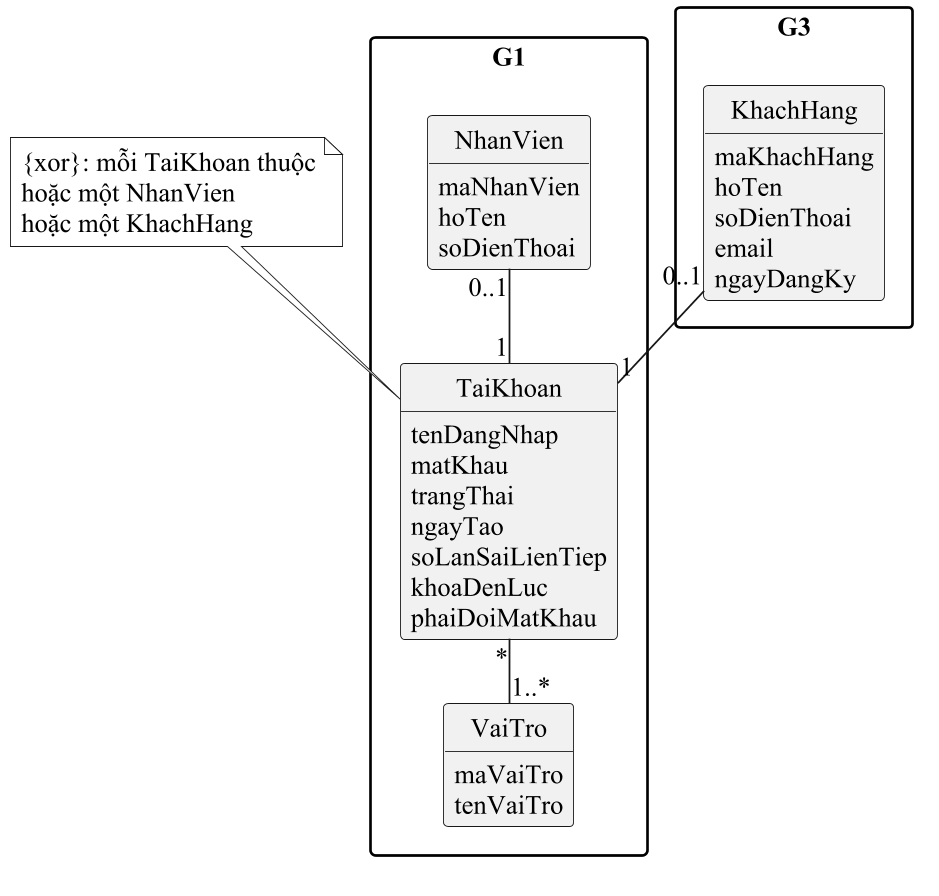
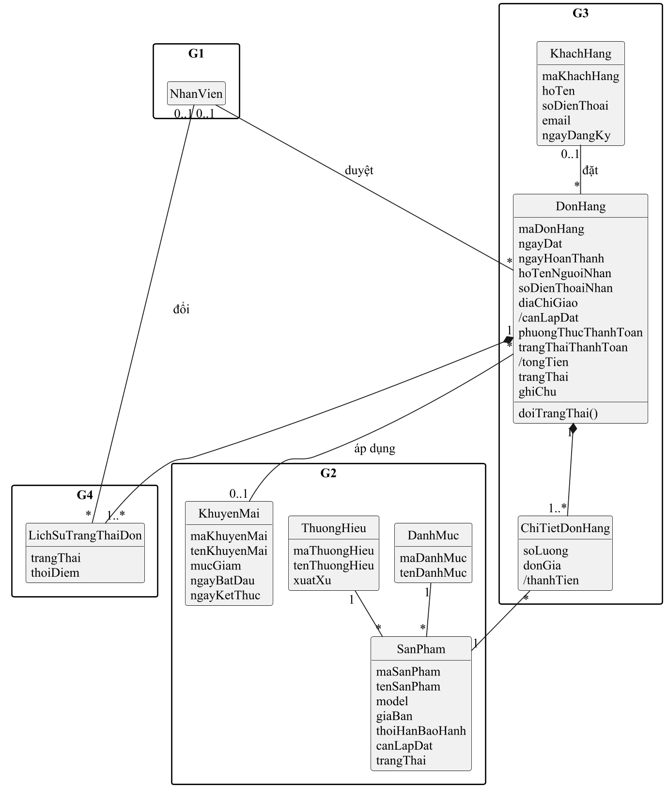
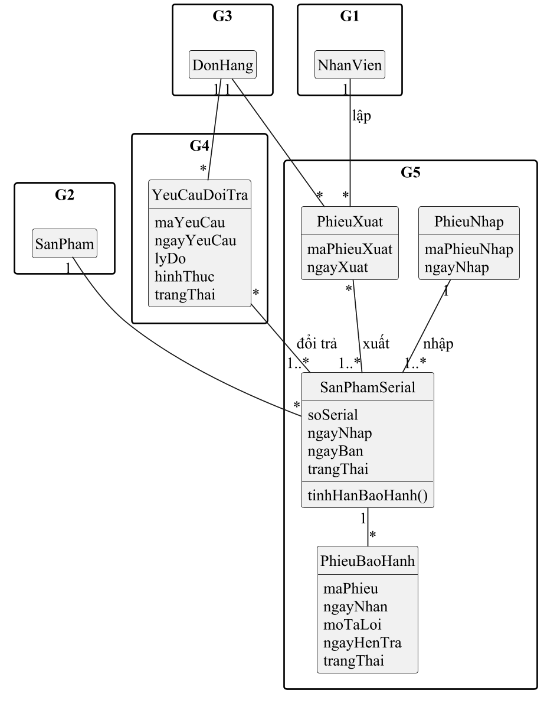

# Lớp dùng chung và trạng thái dùng chung

Bản nháp 0.2 (đã soát chéo) · G1 giữ · việc t112 (làm sớm để 4 gói vẽ cùng một khung) · chốt chính thức ở buổi họp tuần 12 (04/11)

## 1. Sơ đồ lớp khung

Tách làm ba sơ đồ để chữ in ra không nhỏ hơn 9 pt: tài khoản, bán hàng, theo dõi chiếc máy. Lớp xuất hiện ở hai sơ đồ (như `DonHang`, `SanPham`) chỉ ghi đủ thuộc tính ở một nơi.

Chỉ có các lớp **mà từ hai gói trở lên cùng dùng**, nhóm theo gói sở hữu. Lớp chỉ một gói dùng (ví dụ `ThongSoKyThuat` của G2, `PhieuLapDat` của G4) mỗi gói tự thêm vào sơ đồ lớp của mình và nối vào khung này.
Gói sở hữu là gói **đặt tên và quyết thuộc tính**; gói khác chỉ dùng lại, muốn thêm thuộc tính thì báo gói sở hữu.

Thuộc tính có dấu `/` là **thuộc tính dẫn xuất** (tính ra từ dữ liệu khác, không nhập tay).

## 2. Từng lớp

Thuộc tính ghi ở mức phân tích; cột **Kiểu gợi ý** để dùng lại khi tinh chế ở chương 6.

### G1 sở hữu: `TaiKhoan`, `VaiTro`, `NhanVien`
| Lớp | Thuộc tính | Ghi chú |
|---|---|---|
| `TaiKhoan` | tenDangNhap, matKhau (đã băm), trangThai (Đang dùng, Đã khoá), ngayTao, soLanSaiLienTiep, khoaDenLuc, phaiDoiMatKhau | Ba thuộc tính cuối phục vụ quy tắc của UC-HT-01 (khoá 15 phút sau 5 lần sai, đổi mật khẩu lần đầu) |
| `VaiTro` | maVaiTro, tenVaiTro | Khách hàng, Nhân viên bán hàng, Thủ kho, Nhân viên giao hàng – kỹ thuật, Quản lý cửa hàng, Quản trị hệ thống. Một tài khoản có **nhiều vai** vì cửa hàng nhỏ một người kiêm nhiều việc |
| `NhanVien` | maNhanVien, hoTen, soDienThoai | |

### G2 sở hữu: `DanhMuc`, `ThuongHieu`, `SanPham`, `KhuyenMai`
| Lớp | Thuộc tính | Ghi chú |
|---|---|---|
| `DanhMuc` | maDanhMuc, tenDanhMuc | |
| `ThuongHieu` | maThuongHieu, tenThuongHieu, xuatXu | |
| `SanPham` | maSanPham, tenSanPham, model, giaBan, thoiHanBaoHanh (tháng), canLapDat, trangThai (Đang bán, Ngừng bán) | Một **mẫu máy**. `canLapDat` để G4 biết đơn có việc lắp |
| `KhuyenMai` | maKhuyenMai, tenKhuyenMai, mucGiam, ngayBatDau, ngayKetThuc | G3 áp vào đơn qua UC-MH-08 |

### G3 sở hữu: `KhachHang`, `DonHang`, `ChiTietDonHang`
| Lớp | Thuộc tính | Ghi chú |
|---|---|---|
| `KhachHang` | maKhachHang, hoTen, soDienThoai, email, ngayDangKy | Chỉ người **đã đăng ký** mới có |
| `DonHang` | maDonHang, ngayDat, ngayHoanThanh, hoTenNguoiNhan, soDienThoaiNhan, diaChiGiao, /canLapDat, phuongThucThanhToan, trangThaiThanhToan, /tongTien, trangThai, ghiChu | `trangThaiThanhToan`: Chưa thanh toán, Đã thanh toán, Đã hoàn tiền. `ngayHoanThanh` dùng tính doanh thu (QĐ2 của QT-01) |
| `ChiTietDonHang` | soLuong, donGia, /thanhTien | `donGia` là giá **lúc đặt**, không đổi khi `SanPham.giaBan` đổi |

### G4 sở hữu: `YeuCauDoiTra`, `LichSuTrangThaiDon`
| Lớp | Thuộc tính | Ghi chú |
|---|---|---|
| `YeuCauDoiTra` | maYeuCau, ngayYeuCau, lyDo, hinhThuc (Đổi máy, Trả hàng), trangThai (Chờ duyệt, Đã duyệt, Từ chối) | Quản lý cửa hàng duyệt |
| `LichSuTrangThaiDon` | trangThai, thoiDiem | Mỗi lần đơn đổi trạng thái thêm một dòng: ai đổi, lúc nào (quy tắc 3 ở mục 4) |

### G5 sở hữu: `SanPhamSerial`, `PhieuNhap`, `PhieuXuat`, `PhieuBaoHanh`
| Lớp | Thuộc tính | Ghi chú |
|---|---|---|
| `SanPhamSerial` | soSerial, ngayNhap, ngayBan, trangThai | Một **chiếc máy cụ thể**. Hạn bảo hành = `ngayBan` + `SanPham.thoiHanBaoHanh` |
| `PhieuNhap` | maPhieuNhap, ngayNhap | G1 đọc để báo cáo. Chi tiết theo nhà cung cấp G5 tự thêm |
| `PhieuXuat` | maPhieuXuat, ngayXuat | Ghi **chính xác những chiếc máy** giao cho đơn |
| `PhieuBaoHanh` | maPhieu, ngayNhan, moTaLoi, ngayHenTra, trangThai | Phiếu tiếp nhận bảo hành; G5 quyết có tách phiếu bảo hành lúc bán hay không |

`HoaDon` (hoá đơn bán hàng): G3 quyết sau khảo sát có tách khỏi `DonHang` hay không.

## 3. Mối kết hợp

| Lớp A | Bản số A | Lớp B | Bản số B | Ý nghĩa |
|---|---|---|---|---|
| NhanVien | 0..1 | TaiKhoan | 1 | Mỗi nhân viên có đúng một tài khoản |
| KhachHang | 0..1 | TaiKhoan | 1 | Mỗi khách đã đăng ký có đúng một tài khoản. Ràng buộc `{xor}`: một tài khoản thuộc **hoặc** một nhân viên **hoặc** một khách hàng |
| TaiKhoan | * | VaiTro | 1..* | Một tài khoản có thể kiêm nhiều vai |
| DanhMuc | 1 | SanPham | * | |
| ThuongHieu | 1 | SanPham | * | |
| SanPham | 1 | SanPhamSerial | * | Một mẫu máy có nhiều chiếc |
| PhieuNhap | 1 | SanPhamSerial | 1..* | Mỗi chiếc máy được nhập vào kho theo đúng một phiếu nhập |
| KhachHang | 0..1 | DonHang | * | Đơn của khách vãng lai không gắn khách hàng |
| DonHang | 1 | ChiTietDonHang | 1..* | Quan hệ thành phần: xoá đơn thì xoá chi tiết |
| SanPham | 1 | ChiTietDonHang | * | |
| KhuyenMai | 0..1 | DonHang | * | **Đề xuất:** một đơn áp tối đa một khuyến mãi (G2, G3 chốt) |
| NhanVien | 0..1 | DonHang | * | Nhân viên bán hàng duyệt đơn |
| DonHang | 1 | LichSuTrangThaiDon | 1..* | Quan hệ thành phần |
| NhanVien | 0..1 | LichSuTrangThaiDon | * | Người đổi trạng thái (khách tự đặt, tự huỷ thì để trống) |
| DonHang | 1 | PhieuXuat | * | Đơn chưa xuất thì chưa có phiếu; đổi máy thì có thêm phiếu |
| PhieuXuat | * | SanPhamSerial | 1..* | Một chiếc máy có thể nằm trên nhiều phiếu xuất (xuất lại sau khi quay về kho) |
| NhanVien | 1 | PhieuXuat | * | Thủ kho lập phiếu |
| DonHang | 1 | YeuCauDoiTra | * | |
| YeuCauDoiTra | * | SanPhamSerial | 1..* | Những chiếc máy khách đổi hoặc trả |
| SanPhamSerial | 1 | PhieuBaoHanh | * | Một chiếc máy có thể bảo hành nhiều lần |

## 4. Trạng thái đơn hàng (G3 tạo, G4 đổi)

Màu nhãn khớp với bộ giao diện chung: vàng là đang chờ người xử lý, xanh là xong, đỏ là huỷ hoặc lỗi, xám là đang chạy.

| Từ | Sang | Ai | Use case | Khi nào | Nhãn |
|---|---|---|---|---|---|
| (mới) | Chờ xác nhận | Khách | UC-MH-04 | Vừa đặt xong | vàng |
| Chờ xác nhận | Đã huỷ | Khách | UC-MH-07 | Khách tự huỷ | đỏ |
| Chờ xác nhận | Đã xác nhận | Nhân viên bán hàng | UC-DH-01 | Gọi được khách, còn hàng | xám |
| Chờ xác nhận | Đã huỷ | Nhân viên bán hàng | UC-DH-01 | Không liên lạc được, hết hàng | đỏ |
| Đã xác nhận | Đã huỷ | Nhân viên bán hàng | UC-DH-01 | Khách gọi huỷ **trước khi xuất kho** | đỏ |
| Đã xác nhận | Đang giao | Thủ kho | UC-KB-04 | Lập phiếu xuất, giao cho người đi giao hoặc đơn vị vận chuyển | xám |
| Đang giao | Hoàn thành | Nhân viên giao hàng – kỹ thuật (đơn tự giao) hoặc Nhân viên bán hàng (đơn gửi đơn vị vận chuyển) | UC-DH-03; đơn có lắp thì ở UC-DH-05 | Khách đã nhận, đã lắp xong nếu có lắp | xanh |
| Đang giao | Giao không thành công | Nhân viên giao hàng – kỹ thuật hoặc Nhân viên bán hàng | UC-DH-03 | Khách từ chối nhận | đỏ |
| Hoàn thành | Đã trả hàng | Nhân viên bán hàng | UC-DH-06 | Khách trả **toàn bộ** đơn, Quản lý cửa hàng đã duyệt | đỏ |

Quy tắc chung:
1. Không quay ngược trạng thái (Hoàn thành không về Đang giao). Sai thì xử lý bằng đổi trả.
2. Đơn **Giao không thành công**: các chiếc máy đã xuất được Thủ kho nhận lại về kho (UC-KB-08). Khách chỉ hẹn giao lại thì đơn vẫn **Đang giao**, ghi chú vào đơn.
3. Mỗi lần đổi trạng thái thêm một dòng `LichSuTrangThaiDon` (ai đổi, lúc nào).
4. Đổi máy hoặc trả một phần: đơn giữ **Hoàn thành**, việc đổi trả ghi trên `YeuCauDoiTra`.

## 5. Trạng thái chiếc máy theo serial (G5 giữ, G4 đổi một phần)

| Từ | Sang | Ai | Use case | Ghi chú |
|---|---|---|---|---|
| (mới) | Trong kho | Thủ kho | UC-KB-03 | Nhập từ nhà cung cấp |
| Trong kho | Đã xuất | Thủ kho | UC-KB-04 | Xuất theo đơn |
| Đã xuất | Đã bán | Nhân viên giao hàng – kỹ thuật hoặc Nhân viên bán hàng | UC-DH-03, UC-DH-05 | Đơn Hoàn thành; **ghi `ngayBan`**, bắt đầu tính bảo hành |
| Đã xuất | Trong kho | Thủ kho | UC-KB-08 | Giao không thành công, máy quay về |
| Đã bán | Đang bảo hành | Nhân viên bán hàng | UC-KB-06 | Nhận máy hư của khách; **giữ nguyên `ngayBan`** |
| Đang bảo hành | Đã bán | Nhân viên bán hàng | UC-KB-06 | Trả máy đã sửa cho khách; **giữ nguyên `ngayBan`** |
| Đã bán | Trả về kho | Nhân viên bán hàng | UC-DH-06 | Yêu cầu đổi trả đã được duyệt |
| Trả về kho | Trong kho | Thủ kho | UC-KB-08 | Kiểm tra máy còn tốt, bán lại được |
| Trả về kho | Lỗi chờ gửi hãng | Thủ kho | UC-KB-08 | Máy lỗi; việc gửi hãng hoặc đổi với nhà cung cấp G5 bổ sung sau khảo sát |

UC-KB-07 Tra cứu bảo hành tìm theo số serial hoặc số điện thoại người mua.
