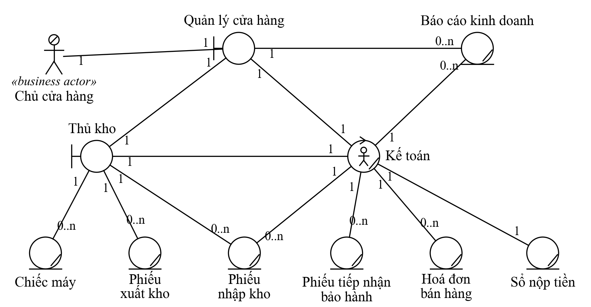
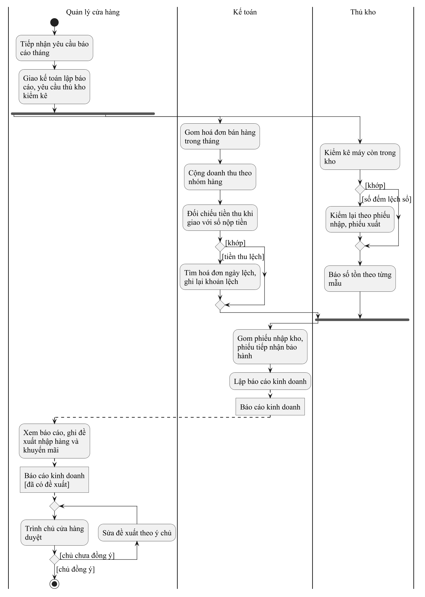
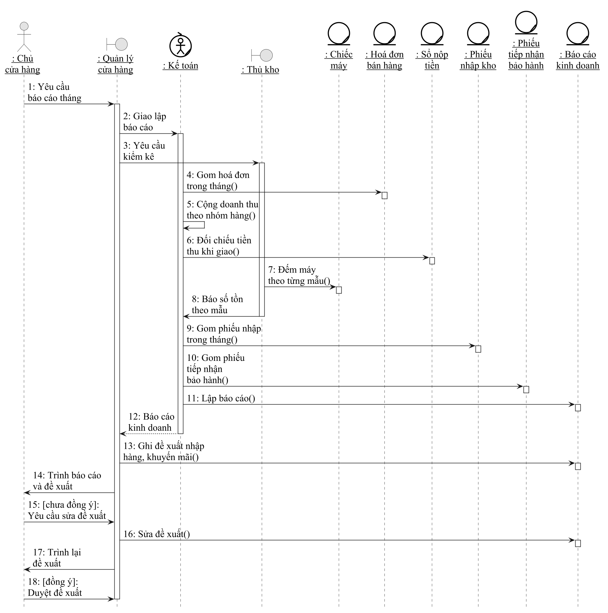

# Mẫu đặc tả use case nghiệp vụ và đặc tả use case hệ thống

Bản 0.2 (07/10/2026, chỉnh theo chương 3 bài giảng) · G1 giữ · cả 5 gói dùng **đúng thứ tự mục** dưới đây để khi ghép báo cáo không lệch nhau

## 1. Đặc tả use case nghiệp vụ (việc t92, C3-38 đến C3-59)

Bài giảng nêu **hai cách** đặc tả use case nghiệp vụ (C3-38): bằng văn bản và bằng sơ đồ. Nhóm quy ước **làm cả hai**, nên mỗi use case nghiệp vụ của gói có đủ 4 phần:

| Phần | Theo slide | Bắt buộc |
|---|---|---|
| 1. Đặc tả bằng văn bản theo **Mẫu 1**: giới thiệu, các dòng cơ bản, các dòng thay thế | C3-39 đến C3-41, C3-58 | Có |
| 2. Sơ đồ đối tượng nghiệp vụ (tác nhân, thừa tác viên, thực thể, bản số) | C3-44 đến C3-51 | Có |
| 3. Sơ đồ hoạt động có luồng | C3-52 đến C3-59 | Có |
| 4. Sơ đồ tuần tự nghiệp vụ (hoặc cộng tác) | C3-61 đến C3-78 | Nếu GV yêu cầu; G1 có ví dụ sẵn |

### Khung văn bản (chép vào phần của gói, thay chữ in nghiêng)

> **Use case nghiệp vụ:** *Tên use case* (*BUC-0x*, quy trình *QT-0x*, gói *Gx*)
>
> Use case bắt đầu khi *sự kiện kích hoạt, thường do tác nhân nghiệp vụ*. Mục tiêu của use case nhằm *kết quả tác nhân nhận được*.
>
> **Các dòng cơ bản:**
> 1. *Thừa tác viên* tiếp nhận yêu cầu … từ *tác nhân* *(mỗi bước bắt đầu bằng tên thừa tác viên, kể cả bước đầu và bước cuối, như C3-41)*
> 2. *Thừa tác viên* … (Thực hiện use case *tên use case được include*)
> 3. …
>
> **Các dòng thay thế:**
> - Tại bước *n*. *Tên xử lý*: nếu *điều kiện*, *thừa tác viên* … *(và quay lại bước nào, hoặc kết thúc)*

Ngay dưới khung, thêm bảng thông tin bổ sung mà slide 39 liệt kê (ràng buộc trước) và những gì đề thi hay hỏi:

| Mục | Nội dung |
|---|---|
| Tác nhân nghiệp vụ | *Lấy trong `tac-nhan-va-thuc-the.md` mục 1* |
| Thừa tác viên | *Lấy trong mục 5; mỗi vai là một luồng trong sơ đồ hoạt động* |
| Thực thể nghiệp vụ | *Lấy trong mục 5; mỗi thực thể là một nút đối tượng hoặc một hình trên sơ đồ đối tượng* |
| Ràng buộc trước khi thực hiện | *Điều phải có trước, ví dụ hoá đơn trong tháng đã lưu đủ* |
| Kết quả | *Khi xong, giấy tờ nào đã có, cái gì đã thay đổi* |
| Quy tắc nghiệp vụ | `QĐ1`, `QĐ2`… mỗi quy tắc một câu, có số liệu nếu có (ví dụ "đổi trong 7 ngày nếu còn nguyên hộp") |
| Biểu mẫu | *Tên thật của biểu mẫu ở cửa hàng, ghi kèm "Hình x.y" nếu có ảnh chụp* |
| Vấn đề hiện tại | *Bước chậm, hay sai mà cửa hàng kể; nối sang bảng vấn đề ở `hien-trang-to-chuc.md` mục 4* |

**Ba sơ đồ phải khớp văn bản:** mỗi bước trong các dòng cơ bản là một hành động trong sơ đồ hoạt động, nằm đúng luồng của người làm bước đó;
mỗi dòng thay thế là một nhánh có điều kiện `[...]`; mỗi giấy tờ nhắc trong văn bản có trên sơ đồ đối tượng nghiệp vụ.

### Ví dụ (G1): BUC-07 Lập báo cáo kinh doanh

> Ví dụ để xem **cách viết và cách vẽ**. Các bước là giả định thường gặp; G1 viết lại theo đúng lời cửa hàng sau khi phỏng vấn.

**1. Đặc tả bằng văn bản**

> **Use case nghiệp vụ:** Lập báo cáo kinh doanh (BUC-07, quy trình QT-01, gói G1)
>
> Use case bắt đầu khi chủ cửa hàng yêu cầu báo cáo tháng (cuối mỗi tháng hoặc đột xuất). Mục tiêu của use case nhằm cung cấp cho chủ cửa hàng
> doanh thu, hàng bán chạy, hàng tồn và số máy đang bảo hành để quyết định nhập hàng, khuyến mãi tháng sau.
>
> **Các dòng cơ bản:**
> 1. Quản lý cửa hàng tiếp nhận yêu cầu báo cáo tháng từ chủ cửa hàng.
> 2. Quản lý cửa hàng giao kế toán lập báo cáo và yêu cầu thủ kho kiểm kê kho.
> 3. Kế toán gom hoá đơn bán hàng trong tháng, cộng doanh thu theo nhóm hàng.
> 4. Kế toán đối chiếu tiền thu khi giao hàng với sổ nộp tiền.
> 5. Thủ kho kiểm kê máy còn trong kho, báo số tồn theo từng mẫu cho kế toán (làm song song với bước 3, 4).
> 6. Kế toán gom phiếu nhập kho, phiếu tiếp nhận bảo hành trong tháng.
> 7. Kế toán lập báo cáo kinh doanh, gửi quản lý cửa hàng.
> 8. Quản lý cửa hàng xem báo cáo, ghi đề xuất nhập hàng và khuyến mãi vào báo cáo.
> 9. Quản lý cửa hàng trình báo cáo và đề xuất cho chủ cửa hàng duyệt.
>
> **Các dòng thay thế:**
> - Tại bước 4. Xử lý tiền thu lệch: nếu tiền thu khi giao lệch với sổ nộp tiền, kế toán tìm hoá đơn của ngày lệch và ghi lại khoản lệch để đưa vào báo cáo ở bước 7.
> - Tại bước 5. Xử lý số kiểm kê lệch: nếu số máy đếm được lệch với sổ, thủ kho kiểm lại theo phiếu nhập kho, phiếu xuất kho trước khi báo số tồn.
> - Tại bước 9. Xử lý đề xuất chưa được duyệt: nếu chủ cửa hàng chưa đồng ý, quản lý cửa hàng sửa đề xuất theo ý chủ rồi trình lại (lặp lại bước 9).

| Mục | Nội dung |
|---|---|
| Tác nhân nghiệp vụ | Chủ cửa hàng |
| Thừa tác viên | Quản lý cửa hàng, Kế toán, Thủ kho |
| Thực thể nghiệp vụ | Hoá đơn bán hàng, Sổ nộp tiền, Phiếu nhập kho, Phiếu xuất kho, Phiếu tiếp nhận bảo hành, Chiếc máy, Báo cáo kinh doanh |
| Ràng buộc trước khi thực hiện | Hoá đơn, phiếu nhập, phiếu tiếp nhận bảo hành trong tháng đã được lưu đủ |
| Kết quả | Chủ cửa hàng nhận báo cáo kinh doanh tháng kèm đề xuất đã duyệt để quyết định nhập hàng, khuyến mãi |
| Quy tắc nghiệp vụ | QĐ1. Báo cáo chốt trước ngày 5 tháng sau. · QĐ2. Doanh thu tính theo ngày giao xong, không theo ngày đặt. |
| Biểu mẫu | Hoá đơn bán hàng, Sổ nộp tiền, Phiếu nhập kho, Phiếu xuất kho, Phiếu tiếp nhận bảo hành, Báo cáo kinh doanh |
| Vấn đề hiện tại | Vấn đề 3 ở `hien-trang-to-chuc.md`: cộng tay từ nhiều sổ, lệch tiền phát hiện muộn |

**2. Sơ đồ đối tượng nghiệp vụ** (làm như C3-51: tác nhân nối với thừa tác viên giao tiếp với nó, thừa tác viên nối với thực thể nó xử lý, ghi bản số hai đầu)

**3. Sơ đồ hoạt động** (chỉ vẽ luồng của thừa tác viên như C3-59; bước 5 song song với bước 3, 4 nên dùng thanh tách và thanh kết hợp xử lý;
báo cáo đi từ kế toán sang quản lý bằng dòng đối tượng nét đứt, nút đối tượng thứ hai ghi trạng thái `[đã có đề xuất]`;
nhánh `[chủ chưa đồng ý]` quay về một nút kết hợp đặt trước bước 9)

**4. Sơ đồ tuần tự nghiệp vụ** (bố cục như C3-72; thông điệp đánh số, gọi xử lý ghi `()` theo C3-69; trả về nét đứt; thông điệp có điều kiện ghi `[điều kiện]:` theo C3-70, C3-77)

## 2. Mẫu đặc tả use case hệ thống (việc t103, chương 4)

Chương 4 (mô tả use case) chưa có slide; giữ mẫu dưới đây, sẽ đối chiếu khi có bài giảng chương 4.

| Mục | Nội dung |
|---|---|
| Mã, tên | *UC-XX-0x Tên use case* |
| Gói | |
| Tác nhân chính | *Người bắt đầu use case* |
| Tác nhân phụ | *Hệ thống ngoài hoặc người nhận kết quả; không có thì ghi "Không có"* |
| Mô tả | *Một câu: ai làm gì để đạt gì* |
| Điều kiện trước | *Ví dụ: đã đăng nhập với vai trò Thủ kho* |
| Điều kiện sau | *Dữ liệu nào đã được tạo, sửa; trạng thái nào đã đổi* |
| Màn hình | *Tệp trong `giao-dien/`, ví dụ `quan-tri/phieu-nhap.html`* |

**Luồng sự kiện chính** (hai cột để thấy rõ ai làm, hệ thống đáp gì)

| Bước | Tác nhân | Hệ thống |
|---|---|---|
| 1 | | |

**Luồng thay thế:** `2a. …` · **Ngoại lệ:** lỗi không lường trước (mất kết nối, dữ liệu trùng) · **Quy tắc nghiệp vụ:** dẫn lại `QĐx` của quy trình nếu có.

### Ví dụ (G1): UC-HT-01 Đăng nhập

| Mục | Nội dung |
|---|---|
| Mã, tên | UC-HT-01 Đăng nhập |
| Gói | G1 |
| Tác nhân chính | Nhân viên, Khách hàng |
| Tác nhân phụ | Không có |
| Mô tả | Người dùng nhập tên đăng nhập và mật khẩu để dùng các chức năng theo vai trò của mình |
| Điều kiện trước | Người dùng đã có tài khoản ở trạng thái Đang dùng |
| Điều kiện sau | Người dùng ở trong phiên làm việc; hệ thống biết vai trò để hiện đúng menu |
| Màn hình | `giao-dien/khach/dang-nhap.html` |

| Bước | Tác nhân | Hệ thống |
|---|---|---|
| 1 | Mở trang đăng nhập | Hiện ô tên đăng nhập, ô mật khẩu, ô "ghi nhớ đăng nhập" |
| 2 | Nhập tên đăng nhập, mật khẩu, bấm Đăng nhập | Kiểm tra hai ô không để trống |
| 3 | | Tìm tài khoản theo tên đăng nhập, so mật khẩu đã băm |
| 4 | | Mở phiên làm việc; khách hàng về trang chủ, nhân viên về trang Tổng quan quản trị |

Luồng thay thế:
- `2a.` Để trống ô nào: báo ngay dưới ô đó, không gửi đi.
- `3a.` Sai tên đăng nhập hoặc mật khẩu: báo chung "Tên đăng nhập hoặc mật khẩu không đúng" (không nói rõ sai ô nào), cho nhập lại.
- `3b.` Sai quá 5 lần liên tiếp: khoá đăng nhập 15 phút.
- `3c.` Tài khoản ở trạng thái Đã khoá: báo "Tài khoản đã bị khoá, liên hệ cửa hàng".

Quy tắc nghiệp vụ: mật khẩu chỉ lưu dạng đã băm; nhân viên đăng nhập lần đầu phải đổi mật khẩu được cấp.
