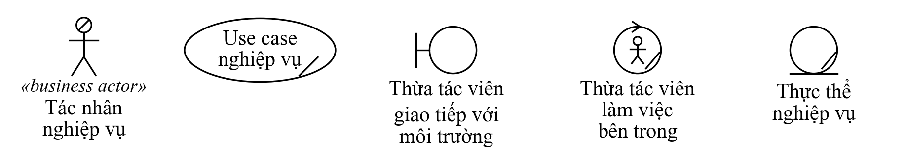

# Quy ước vẽ sơ đồ và đặt tên

Bản 0.2 (07/10/2026, chỉnh theo bài giảng chương 1, 1.2, 2, 3) · G1 giữ · áp dụng cho cả 5 gói

Số slide ghi dạng `C3-53` = chương 3, slide 53. Phân tích đầy đủ 4 chương và các chỗ bài giảng chưa thống nhất: [`doi-chieu-giao-trinh.md`](doi-chieu-giao-trinh.md).

## 1. Công cụ

- Bài giảng (C1.2-30) và đề cương nêu **Rational Rose** và **PowerDesigner**; phần lớn hình mẫu sơ đồ ở chương 3 (use case nghiệp vụ, đối tượng nghiệp vụ, hoạt động C3-59, tuần tự, cộng tác) vẽ bằng Rational Rose. **Chờ GV chốt** công cụ bắt buộc.
- Nếu dùng Rational Rose: đặt stereotype `business actor`, `business use case`, `business worker`, `business entity` cho phần tử, Rose tự vẽ đúng hình như slide.
- Nếu dùng công cụ khác (StarUML, draw.io, Visual Paradigm Online): công cụ không có sẵn hình thừa tác viên, thực thể nghiệp vụ thì **ghi stereotype bằng chữ**
  (`«business worker»`, `«business entity»`) và dùng hình gần nhất; nộp vào repo cả tệp gốc lẫn ảnh PNG.
- Sơ đồ chung trong `so-do/`: sơ đồ use case, hoạt động, tuần tự, lớp viết bằng PlantUML (`.puml`);
  sơ đồ cần hình thừa tác viên và thực thể (bảng ký hiệu, sơ đồ đối tượng nghiệp vụ, sơ đồ tổ chức) vẽ bằng `ve_nghiep_vu.py` (Python, matplotlib).

## 2. Mã và tên

| Đối tượng | Mã | Tên | Ví dụ |
|---|---|---|---|
| Use case nghiệp vụ | `BUC-01`… | **Động từ** + việc, là chuỗi nhiều bước, không phải một bước đơn (C3-27, C3-28) | BUC-05 Nhập hàng |
| Quy trình nghiệp vụ | `QT-01`… | Trùng ý với use case nghiệp vụ | QT-05 Đặt hàng nhà cung cấp và nhập kho |
| Tác nhân nghiệp vụ | | **Danh từ** chỉ vai, đứng ngoài hệ thống nghiệp vụ (C3-22) | Nhà cung cấp |
| Thừa tác viên | | Danh từ chỉ **vai trò, không phải chức vụ** (C3-45) | Thủ kho (không ghi "chú Tư", không ghi "phó phòng") |
| Thực thể nghiệp vụ | | Tên đúng như giấy tờ, đồ vật ở cửa hàng (C3-48) | Phiếu nhập kho |
| Use case hệ thống | `UC-<gói>-01`… với gói `HT`, `SP`, `MH`, `DH`, `KB` | Động từ + bổ ngữ, nhìn từ phía người dùng | UC-KB-03 Lập phiếu nhập kho |
| Lớp | | PascalCase không dấu, số ít | `PhieuNhap`, `ChiTietDonHang` |
| Thuộc tính | | camelCase không dấu | `soSerial`, `ngayDat`, `giaBan` |
| Phương thức | | camelCase, bắt đầu bằng động từ | `tinhTongTien()`, `doiTrangThai()` |
| Hình trong báo cáo | | `Hình <chương>.<số>: <tên>` dưới hình | Hình 3.1: Sơ đồ use case nghiệp vụ tổng |

Cùng một khái niệm chỉ có **một tên** trong cả báo cáo. Ví dụ đã chốt "Nhân viên giao hàng – kỹ thuật" thì không viết lúc "thợ", lúc "kỹ thuật viên".
Bài giảng gọi người thực hiện nghiệp vụ là **thừa tác viên**; không dùng lại chữ "nhân viên nghiệp vụ" của bản 0.1.

## 3. Ký hiệu theo từng loại sơ đồ

### 3.1. Sơ đồ use case nghiệp vụ (C3-20 đến C3-37)

- **Ranh giới:** hình chữ nhật, tên hệ thống nghiệp vụ ghi ở đỉnh (C3-21). Use case nghiệp vụ nằm trong, tác nhân nằm ngoài.
- **Tác nhân nghiệp vụ:** người hình que, ghi `«business actor»` trên tên (C3-21, C3-22). Tác nhân là người **kích hoạt, cung cấp thông tin, nhận kết quả**;
  người **thực hiện** là thừa tác viên, không vẽ thành tác nhân (C3-26).
- **Use case nghiệp vụ:** elip có gạch chéo ở góc dưới phải, tên là động từ (C3-27).
- **Quan hệ** (C3-31 đến C3-36): giao tiếp tác nhân – use case (nét liền), tổng quát hoá giữa các tác nhân (mũi tên tam giác rỗng),
  `«extend»` (use case mở rộng trỏ về use case gốc, chỉ chạy khi có điều kiện), `«include»` (use case gốc trỏ tới phần dùng chung, luôn chạy).
- Thừa tác viên và thực thể **không** đặt trên sơ đồ use case nghiệp vụ; chúng nằm ở sơ đồ đối tượng nghiệp vụ.

### 3.2. Sơ đồ đối tượng nghiệp vụ (C3-44 đến C3-51)

- Ba thành phần: thừa tác viên, thực thể nghiệp vụ, mối quan hệ giữa chúng (C3-44). Vẽ thêm tác nhân nghiệp vụ nối với thừa tác viên giao tiếp với nó (C3-51).
- **Thừa tác viên giao tiếp với môi trường:** hình tròn có vạch đứng bên trái (hình biên). **Thừa tác viên làm việc bên trong:** hình tròn có người, mũi tên trên đỉnh (C3-47, C3-66).
- **Thực thể nghiệp vụ:** hình tròn có gạch dưới. Phân nhóm thông tin (giấy tờ, sổ sách, báo cáo) hay vật thể (hàng hoá) ghi ở bảng, không đổi hình (C3-48, C3-49).
- Mỗi mối quan hệ ghi **bản số hai đầu** như C3-51: `1`, `0..n`.
- Mỗi use case nghiệp vụ một sơ đồ; lấy thành phần từ bảng mục 5 của [`tac-nhan-va-thuc-the.md`](tac-nhan-va-thuc-the.md).

### 3.3. Sơ đồ hoạt động (C3-52 đến C3-59)

12 ký hiệu theo bảng C3-53, C3-54:

| STT | Thuật ngữ | Ký hiệu | Dùng khi |
|---|---|---|---|
| 1 | Nút khởi tạo | Chấm tròn đen | Mỗi sơ đồ đúng một nút |
| 2 | Nút kết thúc hoạt động | Chấm đen có vòng ngoài | Cả quy trình dừng |
| 3 | Nút kết thúc dòng | Vòng tròn có dấu X | Chỉ một nhánh dừng, nhánh khác vẫn chạy |
| 4 | Hành động | Hình chữ nhật bo góc | Tên bắt đầu bằng **động từ**: "Kiểm đếm hàng" |
| 5 | Dòng điều khiển | Mũi tên nét liền | Thứ tự thực hiện |
| 6 | Dòng đối tượng | Mũi tên **nét đứt** | Giấy tờ đi từ hành động này sang hành động khác |
| 7 | Nút quyết định | Hình thoi, **không ghi chữ bên trong**; điều kiện ghi trên từng nhánh trong ngoặc vuông | `[đúng]`, `[sai]`, `[còn hàng]` |
| 8 | Nút kết hợp | Hình thoi gom các nhánh lại | Sau mỗi rẽ nhánh |
| 9 | Thanh tách xử lý | Vạch đậm một vào nhiều ra | Hai việc làm song song |
| 10 | Thanh kết hợp xử lý | Vạch đậm nhiều vào một ra | Chờ các việc song song xong |
| 11 | Nút đối tượng | Hình chữ nhật ghi tên đối tượng (hoặc hình thực thể như C3-59) | Giấy tờ, thực thể nghiệp vụ |
| 12 | Luồng (swimlane) | Cột có tên | Mỗi cột một thừa tác viên (C3-57). Tác nhân chỉ gửi yêu cầu, nhận kết quả nên không vẽ thành luồng, như C3-59 chỉ có luồng Thủ thư |

- Ở mức nghiệp vụ hiện trạng **không có luồng "Hệ thống"**: một hành động có thể làm tay hay tự động (C3-52).
- Nút đối tượng đặt **giữa** hành động tạo ra nó và hành động dùng nó, nối bằng dòng đối tượng nét đứt.
- Nhánh quay lại (lặp) phải đi vào một **nút kết hợp** đặt trước hành động, không cắm thẳng vào hành động. Trong PlantUML dùng `repeat` đứng riêng một dòng (vẽ ra hình thoi kết hợp) và `backward :…;` cho việc làm trên đường quay lại.
  Trong PlantUML: `-[dashed]->` rồi `:Báo cáo kinh doanh; <<object>>` rồi `-[dashed]->`.
- Thứ tự hành động phải khớp **các dòng cơ bản** trong đặc tả; mỗi **dòng thay thế** là một nhánh của nút quyết định.

### 3.4. Sơ đồ tuần tự và cộng tác nghiệp vụ (C3-61 đến C3-78)

- Thành phần: tác nhân, đối tượng, đường sống, kích hoạt thực thi, thông điệp, thông điệp có điều kiện, kết thúc đối tượng (C3-64).
- Đối tượng ghi dạng `: Tên` có gạch dưới, dùng đúng hình thừa tác viên và thực thể như sơ đồ đối tượng nghiệp vụ (C3-66, C3-72).
- Thông điệp **đánh số**: `1: Yêu cầu báo cáo tháng`; thông điệp gọi xử lý ghi kèm `()`; trả về vẽ nét đứt (C3-69); có điều kiện ghi `18: [đồng ý]: Duyệt đề xuất` (C3-70, C3-77).
- Sơ đồ cộng tác dùng cùng các thông điệp, đánh số giống hệt; trong Rational Rose bấm F5 trên sơ đồ tuần tự để Rose sinh sơ đồ cộng tác.

### 3.5. Use case hệ thống (chương 4, chưa có slide)

- `include`: use case gốc **luôn luôn** gọi use case kia, và use case kia cũng là một việc người dùng làm được riêng. Ví dụ UC-KB-06 "Tiếp nhận bảo hành" include UC-KB-07 "Tra cứu bảo hành". Không biến một bước tính toán nội bộ thành use case.
- `extend`: chỉ gọi khi **có điều kiện**. Ví dụ UC-MH-08 "Áp mã giảm giá" extend UC-MH-04 "Đặt hàng".
- **Không** vẽ include "Đăng nhập" vào từng use case. Ghi "đã đăng nhập" ở điều kiện trước của đặc tả.
- Quan hệ tổng quát hoá giữa tác nhân lấy đúng theo `tac-nhan-va-thuc-the.md` mục 6. Tác nhân trừu tượng (Nhân viên) ghi kèm `{abstract}`.

### 3.6. Sơ đồ lớp và sơ đồ trạng thái (chương 5–6; C1.2-18 đến C1.2-21)

- Mức phân tích: tên lớp, thuộc tính, phương thức chính, mối kết hợp có **bản số hai đầu** (`1`, `0..1`, `*`, `1..*`). Thuộc tính dẫn xuất (tính ra từ dữ liệu khác) ghi dấu `/` phía trước: `/tongTien`.
- Ghi gói sở hữu bằng cách **gom lớp vào gói** (package `G2`…), không dùng stereotype `«G2»` (stereotype dành cho phân loại như `«entity»`, `«boundary»`).
- Mức thiết kế (C1.2-12, bước 2): thêm kiểu dữ liệu `hoTen : String`, phạm vi truy cập (`-` riêng, `+` công khai, `#` bảo vệ), chiều điều hướng.
- Lớp kết hợp (như `ChiTietDonHang`) vẽ bằng nét đứt nối vào giữa mối kết hợp, hoặc tách thành lớp riêng có hai mối kết hợp. Cả nhóm dùng **cách tách lớp riêng**.
- Sơ đồ trạng thái vẽ cho lớp có vòng đời rõ (C1.2-20, C1.2-21): `DonHang`, `SanPhamSerial`; mỗi mũi tên ghi sự kiện gây chuyển, lấy từ bảng chuyển trạng thái trong `lop-va-trang-thai-chung.md`.

### 3.7. Sơ đồ tuần tự hệ thống (chương 7, chưa có slide)

- Thứ tự đối tượng từ trái sang phải: tác nhân → lớp giao diện → lớp nghiệp vụ (`...BUS`) → lớp truy cập dữ liệu (`...DAO`) → lớp thực thể.
- Luồng thay thế vẽ bằng khối `alt`, lặp bằng `loop`.

## 4. Cỡ chữ khi đưa vào báo cáo

Báo cáo in A4, phần chữ rộng tối đa 15 cm. Chữ trong sơ đồ in ra phải **từ 9 pt trở lên**:
- Sơ đồ quá rộng thì tách: một sơ đồ tổng quát + các sơ đồ phân rã.
- Use case quá 12 ca trên một sơ đồ thì tách theo tác nhân hoặc theo nhóm chức năng.
- Sơ đồ hoạt động quá 5 luồng thì ngắt dòng tên hành động cho hẹp cột (PlantUML: `skinparam wrapWidth`).
- Xuất ảnh PNG độ phân giải cao (draw.io: Export → PNG, zoom 200%; Rose: copy sơ đồ rồi dán vào Word ở chế độ ảnh).
