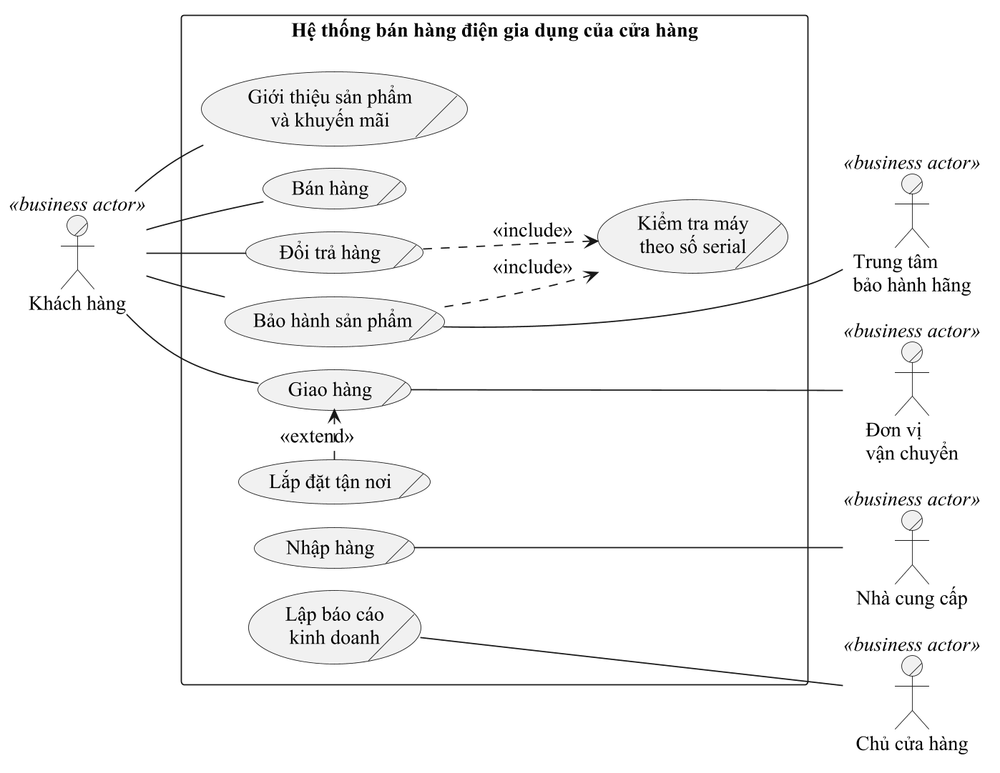
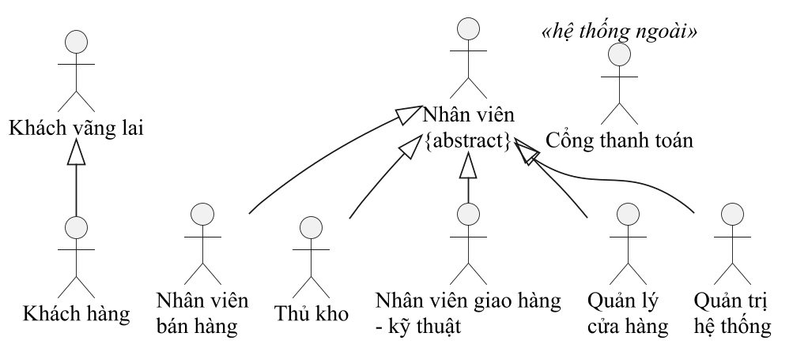

# Tác nhân, thừa tác viên, thực thể và use case nghiệp vụ

Bản nháp 0.3 (07/10/2026, chỉnh theo chương 3 bài giảng) · G1 giữ · việc t91, t93, t95 · **chỉnh lại sau khi phỏng vấn cửa hàng thật**

Tên gọi theo đúng bài giảng: **tác nhân nghiệp vụ** (business actor), **thừa tác viên** (business worker), **thực thể nghiệp vụ** (business entity),
**use case nghiệp vụ** hay chức năng nghiệp vụ (business use case). Ký hiệu từng loại xem [`quy-uoc-ve.md`](quy-uoc-ve.md) mục 3.
Số slide ghi dạng `C3-22` nghĩa là chương 3, slide 22 của bài giảng Bộ môn HTTT.

Cửa hàng nhỏ thường một người kiêm nhiều việc (chủ kiêm kế toán, nhân viên bán hàng kiêm thủ kho). Theo slide 45, thừa tác viên là **vai trò, không phải chức vụ**,
nên vẫn tách theo vai; ai kiêm vai nào thì ghi ở phần mô tả tổ chức ([`hien-trang-to-chuc.md`](hien-trang-to-chuc.md)).

## 1. Tác nhân nghiệp vụ (C3-22 đến C3-26)

Tác nhân nghiệp vụ nằm ngoài phạm vi hệ thống nghiệp vụ, trao đổi thông tin, đưa đầu vào hoặc nhận đầu ra, **không điều khiển** hoạt động của hệ thống.
Người **thực hiện** nghiệp vụ là thừa tác viên, không vẽ thành tác nhân (slide 26: Thủ thư sai, Độc giả đúng).

| Tác nhân nghiệp vụ | Là ai | Vai trò với nghiệp vụ | Tham gia |
|---|---|---|---|
| Khách hàng | Người mua máy về dùng trong gia đình hoặc cho quán, văn phòng | Kích hoạt, cung cấp thông tin, nhận kết quả | BUC-01, 02, 03, 04, 06 |
| Nhà cung cấp | Hãng hoặc nhà phân phối bán hàng cho cửa hàng | Nhận đơn đặt hàng, giao hàng (đầu vào) | BUC-05 |
| Đơn vị vận chuyển | Bên nhận chở hàng đi xa (cửa hàng không tự giao được) | Nhận hàng và chứng từ, báo kết quả giao | BUC-03 |
| Trung tâm bảo hành hãng | Nơi sửa máy còn trong hạn bảo hành của hãng | Nhận máy lỗi, trả máy đã sửa | BUC-06 |
| Chủ cửa hàng | Người đứng tên cửa hàng, ra quyết định kinh doanh | Kích hoạt, nhận kết quả | BUC-07 |

Chủ cửa hàng ở trong tổ chức nhưng **nằm ngoài hệ thống nghiệp vụ đang xét** (slide 13): trong BUC-07 chủ không làm báo cáo mà chỉ yêu cầu và nhận báo cáo,
giống Độc giả ở slide 26. Điểm cần hỏi GV: slide 22 nói tác nhân "không điều khiển hoạt động của hệ thống", trong khi chủ là người quyết định việc kinh doanh.
Nếu GV chỉ chấp nhận tác nhân bên ngoài tổ chức thì bỏ BUC-07 khỏi sơ đồ tổng và trình bày QT-01 như quy trình hỗ trợ.

## 2. Thừa tác viên (C3-45 đến C3-47)

Thừa tác viên chia hai loại (slide 46, 47): **giao tiếp với môi trường** (làm việc trực tiếp với tác nhân nghiệp vụ, vẽ hình biên)
và **làm việc bên trong** (vẽ hình tròn có người). Mỗi thừa tác viên tham gia một use case nghiệp vụ là một luồng (swimlane) trong sơ đồ hoạt động của use case đó.

| Thừa tác viên | Loại | Giao tiếp với tác nhân nào |
|---|---|---|
| Quản lý cửa hàng | Giao tiếp với môi trường | Nhà cung cấp (gửi đơn đặt hàng), Chủ cửa hàng (trình báo cáo, đề xuất) |
| Nhân viên bán hàng | Giao tiếp với môi trường | Khách hàng |
| Thủ kho | Giao tiếp với môi trường | Nhà cung cấp (nhận hàng), Trung tâm bảo hành hãng (gửi và nhận máy) |
| Nhân viên giao hàng – kỹ thuật | Giao tiếp với môi trường | Khách hàng, Đơn vị vận chuyển |
| Kế toán | Làm việc bên trong | Không giao tiếp trực tiếp |

**Mô tả thừa tác viên** theo 5 câu hỏi ở slide 45:

| Thừa tác viên | Trách nhiệm | Kỹ năng cần có | Tương tác với thừa tác viên | Tham gia luồng công việc | Trách nhiệm trong luồng |
|---|---|---|---|---|---|
| Quản lý cửa hàng | Duyệt giá bán, khuyến mãi, đơn đặt hàng nhà cung cấp, đổi trả; xếp lịch giao lắp | Nắm giá thị trường, đọc báo cáo | Cả bốn vai còn lại | BUC-01, 03, 04, 05, 07 | Duyệt, phân công, đề xuất |
| Nhân viên bán hàng | Tư vấn, chốt đơn, gọi xác nhận đơn, tiếp nhận đổi trả và bảo hành | Hiểu tính năng máy, giao tiếp khách | Quản lý, Thủ kho, Kế toán | BUC-01, 02, 03, 04, 06, 09 | Tiếp nhận yêu cầu, lập đơn, lập phiếu |
| Thủ kho | Nhận hàng, kiểm đếm, ghi số serial, xuất kho theo đơn, nhận lại máy, kiểm kê | Kiểm hàng, ghi chép sổ kho | Quản lý, Nhân viên bán hàng, Nhân viên giao hàng – kỹ thuật, Kế toán | BUC-01, 03, 04, 05, 06, 07 | Nhập, xuất, kiểm kê, giữ máy |
| Nhân viên giao hàng – kỹ thuật | Khảo sát chỗ lắp, giao hàng, lắp đặt, thu tiền khi giao | Lắp đặt điện nước, lái xe | Quản lý, Thủ kho, Kế toán | BUC-03, 08 | Giao, lắp, thu tiền, lấy chữ ký |
| Kế toán | Thu chi, đối chiếu tiền thu khi giao, lập báo cáo cuối tháng | Sổ sách, bảng tính | Cả bốn vai còn lại | BUC-02, 04, 05, 07 | Ghi nhận tiền, đối chiếu, lập báo cáo |

## 3. Thực thể nghiệp vụ (C3-48 đến C3-50)

Thực thể nghiệp vụ là sự vật được thừa tác viên xử lý hoặc sử dụng, chia hai nhóm: **thực thể thông tin** (sổ sách, hồ sơ, giấy tờ, báo cáo, tập tin)
và **thực thể vật thể** (hàng hoá, nguyên vật liệu). Cột "Dùng ở" khớp với bảng ở mục 5.

| Thực thể nghiệp vụ | Nhóm | Tạo ra ở | Dùng ở | Lớp tương ứng ở chương 5 |
|---|---|---|---|---|
| Thông tin mẫu máy (thông số, ảnh, giá) | Thông tin | BUC-01 | BUC-01, 02 | `SanPham` |
| Chiếc máy (có số serial) | Vật thể | BUC-05 | BUC-01, 02, 03, 04, 06, 07, 08, 09 | `SanPhamSerial` |
| Bảng giá và khuyến mãi | Thông tin | BUC-01 | BUC-01, 02 | `KhuyenMai` |
| Đơn hàng | Thông tin | BUC-02 | BUC-03 | `DonHang`, `ChiTietDonHang` |
| Hoá đơn bán hàng | Thông tin | BUC-02 | BUC-04, 07, 09 | `HoaDon` (G3 quyết có tách khỏi `DonHang` không) |
| Phiếu bảo hành | Thông tin | BUC-02 (khi bán) | BUC-06, 09 | Không thành lớp riêng: lấy từ `SanPhamSerial` (ngày bán) và `SanPham` (thời hạn bảo hành); G5 quyết |
| Phiếu xuất kho | Thông tin | BUC-03 | BUC-03, 07 | `PhieuXuat` |
| Phiếu giao hàng | Thông tin | BUC-03 | BUC-03 | `PhieuGiaoHang` (G4) |
| Biên bản lắp đặt | Thông tin | BUC-08 | BUC-08 | `PhieuLapDat` (G4) |
| Sổ nộp tiền | Thông tin | BUC-03 | BUC-07 | Không thành lớp; thay bằng `trangThaiThanhToan` của `DonHang` |
| Phiếu đổi trả | Thông tin | BUC-04 | BUC-04 | `YeuCauDoiTra` |
| Đơn đặt hàng nhà cung cấp | Thông tin | BUC-05 | BUC-05 | `DonDatHangNCC` (G5) |
| Phiếu nhập kho | Thông tin | BUC-05 | BUC-07 | `PhieuNhap` |
| Phiếu tiếp nhận bảo hành | Thông tin | BUC-06 | BUC-07 | `PhieuBaoHanh` |
| Báo cáo kinh doanh | Thông tin | BUC-07 | BUC-07 | Không thành lớp, là kết quả truy vấn |

Sau khi phỏng vấn: **chụp được biểu mẫu nào thì ghi tên thật của biểu mẫu đó** vào cột đầu (ví dụ cửa hàng gọi là "phiếu giao nhận" thì dùng đúng chữ đó).

## 4. Use case nghiệp vụ tổng (C3-20 đến C3-37)

Tên use case nghiệp vụ là **động từ**, mỗi use case là **một chuỗi nhiều bước** tạo ra kết quả cho một tác nhân (slide 27, 28).
Hai quan hệ giữa các use case nghiệp vụ làm theo ví dụ ở slide 33–36:
- **«extend»**: "Lắp đặt tận nơi" chỉ chạy khi sản phẩm cần lắp đặt (máy lạnh, máy nước nóng, bếp âm), giống "Xử lý hành lý đặc biệt" mở rộng "Kiểm tra cá nhân".
- **«include»**: cả "Đổi trả hàng" và "Bảo hành sản phẩm" đều phải kiểm tra chiếc máy theo số serial (đúng máy cửa hàng bán, ngày mua, còn hạn),
  nên tách thành một use case riêng, giống "Kiểm tra thẻ thư viện" được "Mượn sách" và "Trả sách" bao hàm.

| Mã | Use case nghiệp vụ | Quy trình chi tiết | Gói | Tác nhân nghiệp vụ | Quan hệ |
|---|---|---|---|---|---|
| BUC-01 | Giới thiệu sản phẩm và khuyến mãi | QT-02 Đưa sản phẩm mới lên bán và chạy khuyến mãi | G2 | Khách hàng | |
| BUC-02 | Bán hàng | QT-03 Đặt hàng và thanh toán | G3 | Khách hàng | |
| BUC-03 | Giao hàng | QT-04 Xử lý đơn, giao hàng và lắp đặt tận nơi | G4 | Khách hàng, Đơn vị vận chuyển | |
| BUC-04 | Đổi trả hàng | QT-07 Tiếp nhận và xử lý đổi trả | G4 | Khách hàng | «include» BUC-09 |
| BUC-05 | Nhập hàng | QT-05 Đặt hàng nhà cung cấp và nhập kho | G5 | Nhà cung cấp | |
| BUC-06 | Bảo hành sản phẩm | QT-06 Tiếp nhận bảo hành theo số serial | G5 | Khách hàng, Trung tâm bảo hành hãng | «include» BUC-09 |
| BUC-07 | Lập báo cáo kinh doanh | QT-01 Lập báo cáo kinh doanh cuối tháng | G1 | Chủ cửa hàng | |
| BUC-08 | Lắp đặt tận nơi | Nhánh lắp đặt của QT-04 | G4 | | «extend» BUC-03 khi [sản phẩm cần lắp đặt] |
| BUC-09 | Kiểm tra máy theo số serial | Chuỗi bước dùng chung cho QT-06, QT-07: tìm hoá đơn theo số serial, đối chiếu đúng máy cửa hàng bán, tính hạn bảo hành và hạn đổi trả | G5 | | Được BUC-04, BUC-06 «include» |

G4 có hai quy trình. Nếu khảo sát cho thấy cửa hàng chỉ đổi trả ngay lúc giao thì G4 gộp QT-07 thành dòng thay thế của QT-04.
G5 đặc tả BUC-09 một lần, G4 dẫn lại ở bước tương ứng của QT-07 ("Thực hiện use case Kiểm tra máy theo số serial", như slide 41 ghi "Thực hiện use case kt thẻ thư viện").

## 5. Thừa tác viên và thực thể của từng use case nghiệp vụ

Bảng này là nguồn cho **sơ đồ đối tượng nghiệp vụ** (slide 51) và **các luồng, nút đối tượng** của sơ đồ hoạt động (slide 57–59) của mỗi gói.
Gói nào thấy thiếu vai hoặc thiếu giấy tờ sau khi phỏng vấn thì báo G1 để thêm vào mục 2, 3.

| BUC | Thừa tác viên (luồng) | Thực thể nghiệp vụ |
|---|---|---|
| BUC-01 | Quản lý cửa hàng, Nhân viên bán hàng, Thủ kho | Thông tin mẫu máy, Bảng giá và khuyến mãi, Chiếc máy (máy trưng bày) |
| BUC-02 | Nhân viên bán hàng, Kế toán | Thông tin mẫu máy, Bảng giá và khuyến mãi, Đơn hàng, Hoá đơn bán hàng, Phiếu bảo hành, Chiếc máy |
| BUC-03 | Nhân viên bán hàng, Quản lý cửa hàng, Thủ kho, Nhân viên giao hàng – kỹ thuật | Đơn hàng, Phiếu xuất kho, Phiếu giao hàng, Chiếc máy, Sổ nộp tiền |
| BUC-04 | Nhân viên bán hàng, Quản lý cửa hàng, Thủ kho, Kế toán | Phiếu đổi trả, Hoá đơn bán hàng, Chiếc máy |
| BUC-05 | Thủ kho, Quản lý cửa hàng, Kế toán | Đơn đặt hàng nhà cung cấp, Phiếu nhập kho, Chiếc máy |
| BUC-06 | Nhân viên bán hàng, Thủ kho | Phiếu bảo hành, Phiếu tiếp nhận bảo hành, Chiếc máy |
| BUC-07 | Kế toán, Thủ kho, Quản lý cửa hàng | Hoá đơn bán hàng, Sổ nộp tiền, Phiếu nhập kho, Phiếu xuất kho, Phiếu tiếp nhận bảo hành, Chiếc máy, Báo cáo kinh doanh |
| BUC-08 | Nhân viên giao hàng – kỹ thuật | Chiếc máy, Biên bản lắp đặt |
| BUC-09 | Nhân viên bán hàng | Chiếc máy, Hoá đơn bán hàng, Phiếu bảo hành |

## 6. Tác nhân hệ thống (người dùng website, chương 4)

Phần này thuộc mô hình hoá chức năng, không phải mô hình hoá nghiệp vụ: tác nhân hệ thống là **người trực tiếp dùng website**,
nên thừa tác viên ở mục 2 (người làm việc trong cửa hàng) trở thành tác nhân hệ thống khi họ thao tác trên website.

| Tác nhân | Kế thừa từ | Làm được gì (tóm tắt) | Gói có use case |
|---|---|---|---|
| Khách vãng lai | | Xem, tìm, so sánh sản phẩm; quản lý giỏ hàng; đăng ký; tra cứu bảo hành | G2, G3, G5 |
| Khách hàng | Khách vãng lai | Đăng nhập, đặt hàng, áp mã giảm giá, thanh toán, theo dõi và huỷ đơn, quản lý hồ sơ, đánh giá sản phẩm | G1, G2, G3 |
| Nhân viên (trừu tượng) | | Đăng nhập, đổi mật khẩu | G1 |
| Nhân viên bán hàng | Nhân viên | Cập nhật sản phẩm, duyệt đơn, cập nhật đơn gửi đơn vị vận chuyển, tiếp nhận đổi trả, tiếp nhận bảo hành | G2, G4, G5 |
| Thủ kho | Nhân viên | Quản lý nhà cung cấp, nhập kho, xuất kho, nhận lại máy, kiểm kê | G5 |
| Nhân viên giao hàng – kỹ thuật | Nhân viên | Cập nhật trạng thái giao, lập biên bản lắp đặt | G4 |
| Quản lý cửa hàng | Nhân viên | Danh mục, giá, khuyến mãi, phân công giao lắp, xác nhận tiền thu khi giao, duyệt đổi trả, xem báo cáo | G1, G2, G4 |
| Quản trị hệ thống | Nhân viên | Tài khoản nhân viên, phân quyền | G1 |
| Cổng thanh toán | | Hệ thống bên ngoài nhận tiền trực tuyến | G3 |

**Kế toán và Chủ cửa hàng** không có tác nhân riêng trên website: họ dùng tài khoản có vai **Quản lý cửa hàng**
(xác nhận tiền thu khi giao, xem báo cáo). Nếu khảo sát cho thấy kế toán là người riêng và làm nhiều việc trên hệ thống thì thêm tác nhân Kế toán kế thừa Nhân viên.

**Còn chờ kết quả khảo sát (G3 quyết):** khách vãng lai có được đặt hàng chỉ bằng số điện thoại hay không.
Đợt thử bảng hỏi cho thấy nhiều người ngại tạo tài khoản; câu K11 của Google Form sẽ trả lời câu này.
Nếu cho phép thì UC-MH-04, UC-MH-06, UC-MH-07 nối với Khách vãng lai, và `DonHang` thêm `hoTenNguoiDat`, `soDienThoaiNguoiDat`
(bắt buộc khi đơn không gắn `KhachHang`), để vẫn tra được đơn và bảo hành theo số điện thoại người mua.
